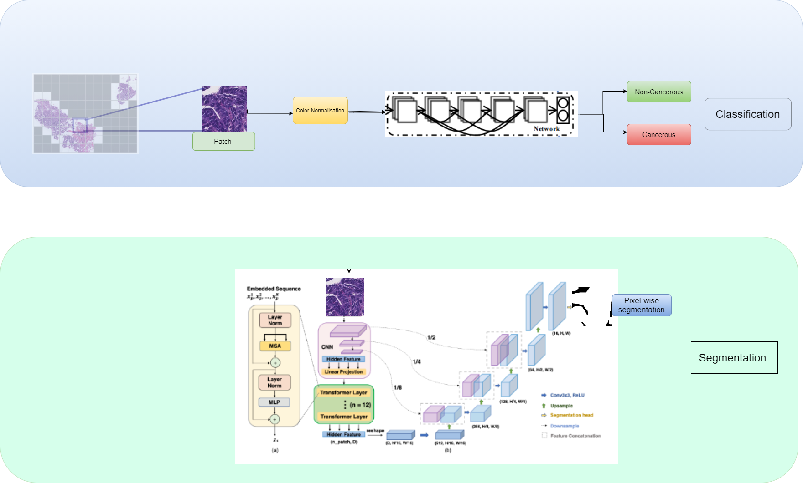

# Detecting-Colorectal-Cancer (DCC)

The project aims to create a pipeline to classify a tissue image as cancerous or non-cancerous and provide pixel level segmentation masks for cancerous images. We use the DigestPath2019 dataset(https://digestpath2019.grand-challenge.org/Dataset/).

After colour normalising the WSI’s and extracting patches using the Otsu algorithm which removes tissue patches having background are greater than a threshold, we used classic deep learning architectures like DenseNet, Resnet and Xception to classify the patches. We consider a whole image to be cancerous or non-cancerous based on the results obtained from the classification network.

We then use a transformer based segmenter with the aim of beating the state-of-the-art results in the domain. The segmenter being used has a CNN-transformer hybrid encoder in which CNN and transformer layer aid each other in learning global and local attention features. Self supervised learning techniques such as contrastive learning were used first to pretrain the model to instill domain knowledge in the network and then the network is finetuned on the specific dataset.

Pipeline:

